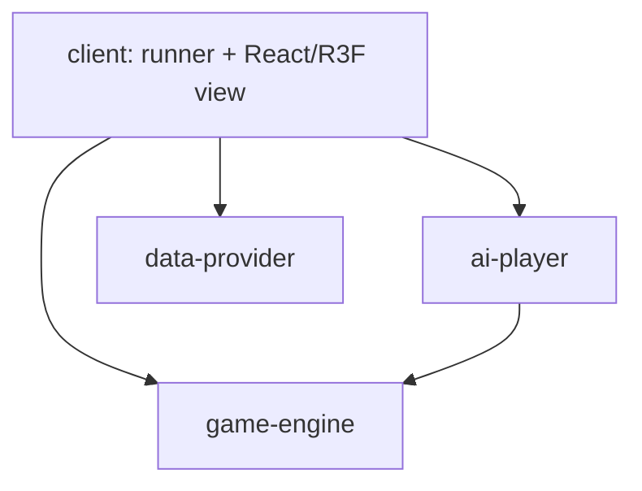

# Code Architecture

## Decision

The repository is an npm workspace with four packages:

- `@ofcpoker/game-engine`: pure OFC domain state, validation, events, replay, snapshots, evaluation, and scoring.
- `@ofcpoker/data-provider`: rules-neutral lobby and message transport contracts plus local and Playroom adapters.
- `@ofcpoker/ai-player`: configurable decision strategies that consume only public engine views and legal actions.
- `@ofcpoker/client`: the React + Vite composition root, game runner, lobby forms, and game-view adapters.

The arrows are the only permitted workspace dependencies. `game-engine` and `data-provider` have no workspace dependencies. `ai-player` depends only on the public `game-engine` entry point. Domain packages must not import `client`, React, DOM/browser APIs, Three.js, React Three Fiber, or Playroom. Playroom imports belong only in the future Playroom adapter inside `data-provider`. Imports through another package's `src` directory are forbidden.

## Engine contract and determinism

The public engine contract is in `packages/game-engine/src/index.ts`.

- An `EngineAction` is a versioned player intent with a globally unique `actionId` and the revision it expects.
- A `GameEvent` is an accepted domain fact with a globally unique `eventId`, monotonic revision, and the action ID that caused it.
- An `EngineSnapshot` is a versioned, serializable checkpoint containing its revision and last event ID.
- A `DeterministicGameEngine` creates state, applies an action without mutating prior state, creates/restores snapshots, and projects public and player-visible state.
- A rejected action returns the unchanged state, no events, and a typed rejection.
- Completed boards are resolved by a pure round scorer that evaluates legality and royalties, scores every unordered player pair, enforces zero-sum totals, and derives next-hand Fantasyland status. Fantasyland boards remain face down during placement and are revealed together at showdown.
- Immutable multi-hand match state records completed resolutions, accumulates each seat's score, carries Fantasyland qualification into the next hand, and rotates the dealer clockwise. Deck order remains an injected per-hand input.
- Hand and match snapshots use schema version 1. Unsupported versions require an explicit migration and fail with typed compatibility errors; malformed current-version snapshots fail with a distinct typed validation error.

The same configuration, initial inputs, and ordered accepted actions must always produce structurally equal state, events, and snapshots. The engine does not read the clock, generate random values, use the network, or inspect browser state. Deck order, IDs, and any other nondeterministic input are injected and recorded. Private cards exist only in the authoritative state and the appropriate player's projection.

## Provider contract

The rules-neutral contract is in `packages/data-provider/src/index.ts`. `DataProvider` creates, joins, or reconnects to a lobby and yields a `LobbyConnection`. Callers supply an untrusted display profile and the provider assigns the trusted participant ID and reconnect capability. A connection exposes immutable lobby metadata, participant presence and role, action submission, host-only validation results, authoritative publication and activation, subscription cleanup, temporary disconnect, permanent leave, and disposal.

Two adapters implement the same interface:

- `LocalDataProvider` keeps all rooms in memory and makes no network or Playroom calls. It provides deterministic injectable IDs, latency, and failure hooks for tests. AI-only games must select this adapter at the composition root.
- `PlayroomDataProvider` will translate the contract to Playroom APIs. Playroom-specific values must not escape the adapter.

Adapters transport opaque JSON actions, validation results, snapshots, and events and do not validate OFC rules. Reusable provider contract tests are run against the local adapter and will also be run against the Playroom adapter. Provider methods reject missing/full/closed lobbies and illegal lifecycle operations with typed errors.

## AI contract

`AiPlayer.decide` receives its own `PlayerVisibleState`, the engine-provided legal actions, and explicit strategy configuration. It returns one ordinary `EngineAction`; the runner submits it through the same authority and validation path as a human action. AI code cannot read authoritative/private opponent state, call the provider, or mutate engine state. Any randomness, clock, or think delay is injected by the future implementation.

## Runner and view ownership

The client owns one `GameRunner` for one active lobby. It is the composition root for an engine, one selected provider, zero or more AI players, and a `GameView`. It subscribes once, coordinates host validation and publication, derives view models, and disposes subscriptions/provider/AI work when leaving or switching lobbies. React components do not own authoritative state and do not call provider SDKs directly.

`GameView` receives a read-only `GameViewModel`, emits ordinary engine actions, and supports disposal. The React Three Fiber view is one adapter. An accessible DOM or alternate 2D view can implement the same port without engine/provider changes. The engine and provider never import the view.

The concrete OFC runner wraps the current hand and multi-hand match in one authoritative snapshot. Its transport revision is monotonic for the lifetime of the lobby even though each engine hand begins at revision zero. Only the host creates decks, advances match state, or publishes this envelope. Human requests use provider-assigned sender identity, while configured local AI seats use their registered identity; both enter the same runner validation function before the engine transition. A view receives only its player projection and engine-enumerated legal actions.

## Configuration ownership

The lobby form produces candidate settings, but lobby creation validates them and copies them into new immutable `LobbySettings`. The host then derives the engine's immutable `GameConfiguration` from that copy. Joiners receive the stored settings; no update-settings operation exists. Starting another hand retains the configuration. Changing rules or seat count requires a new lobby.

The initial supported rules are standard OFC only: 2–4 seats, Fantasyland enabled, and tied rows worth zero. Runtime state such as participants, readiness, cards, and scores is not configuration.
